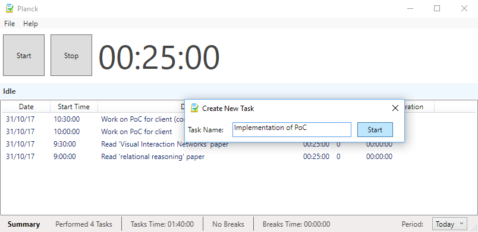

# Planck Pomodoro Timer

From Wikipedia:

> The Pomodoro Technique is a time management method developed by Francesco
> Cirillo in the late 1980s. The technique uses a timer to break down periods
> of work into 25-minute intervals called "pomodori" (from the Italian word
> pomodoro for "tomato"), separated by short breaks.

## Features

* **Configurable.** Set pomodoro and break durations.
* **History.** Provide a name for each task, view tasks from Today, Yesterday, Last 7 Days, Last 30 Days or All Time.
* **Statistics.** Counts and displays the number of tasks, the total duration and breaks.
* **Simple.** All changes are auto-saved, just start a task and work!

## Screenshots

<kbd></kbd>

## Download

To run plank, download it from the link below, unpack and execute:

Download link: [Plank Pomodoro Timer v0.2](https://github.com/loudinthecloud/planck/raw/master/deployments/Planck-v0.2.zip)
